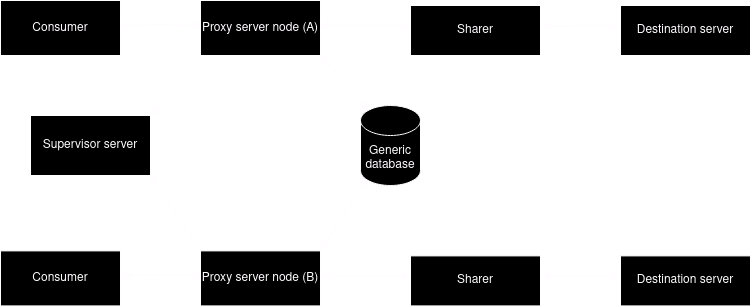

# FlowMesh 
FlowMesh is a forwarding proxy service which consists of consumers and sharers.
# Building
## Dependencies
- [libuv](https://github.com/libuv/libuv)
## Instructions
- `git clone https://github.com/g4iliunas/flowmesh`
- `cd flowmesh/flowmesh`
### Server
- `cd server`
- `mkdir build && cd build`
- `cmake -DCMAKE_BUILD_TYPE=Release ..`
- `make`
### Client
- `cd client`
- `mkdir build && cd build`
- `cmake -DCMAKE_BUILD_TYPE=Release ..`
- `make`
# Design

# License
This project is distributed under the MIT License. Please refer to [License](./LICENSE) for more information.