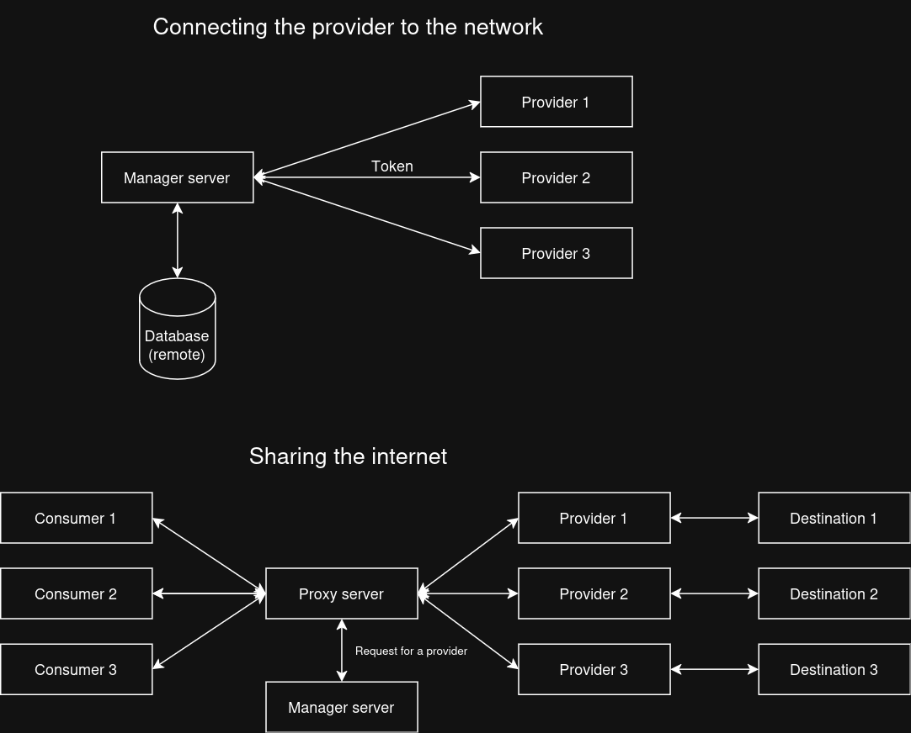

<p align="center">
    
</p>

<p align="center">
    FlowMesh is a high-performance forwarding proxy service written in C++17. It leverages the <a href="https://github.com/libuv/libuv">libuv</a> library for asynchronous I/O operations.
</p>

---

## Features
- SOCKS5 proxy support
- Asynchronous I/O with libuv
- Modular and extensible design

## Design


## Building

### Prerequisites
Ensure you have the following dependencies installed:

- [libuv](https://github.com/libuv/libuv)
- [CMake](https://cmake.org/)

### Instructions

1. Clone the repository:
    ```sh
    git clone https://github.com/g4iliunas/flowmesh
    cd flowmesh/flowmesh
    ```

2. Build the server:
    ```sh
    cd server
    mkdir build && cd build
    cmake -DCMAKE_BUILD_TYPE=Release ..
    make
    ```

3. Build the client:
    ```sh
    cd client
    mkdir build && cd build
    cmake -DCMAKE_BUILD_TYPE=Release ..
    make
    ```

## Usage

### Running the Server
To run the FlowMesh server, execute the following command from the `server/build` directory:

```sh
./flowmesh_server
```

The server initializes both a proxy server and a provider management server. It listens for incoming connections on specified IP addresses and ports, forwarding data between proxy clients (consumers) and providers on a separate network.


### Running the Client
To run the FlowMesh client, execute the following command from the `client/build` directory:

```sh
./flowmesh_client
```

The provider client will connect to the server and wait for connection events to begin the relaying process. It handles incoming connections from the server and forwards data between the server and the intended destination.

## Contributing
Contributions are welcome! Please open an issue or submit a pull request on [GitHub](https://github.com/g4iliunas/flowmesh).

### License
This project is distributed under the MIT License. Please refer to the [License](./LICENSE) file for more information.